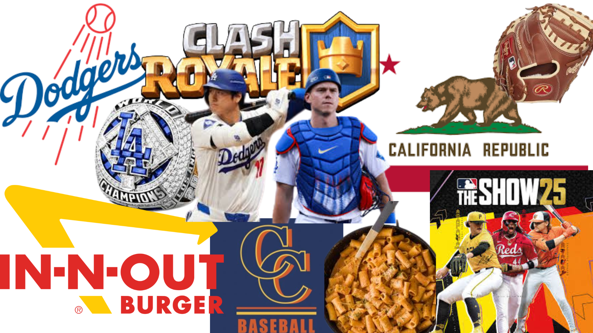

# Me in Markdown
### Introduction

Hello my name is James D'Angelo. I am a 10 grade studen athlete. I play baseball, I am a cathcer on JV. My favorite baseball team is the Dodger and my favorite players are Shohei Ohtani and Will Smith. I am excited to continue learning Computer Science and pass the AP test!
### Body Paragraph
One of my favorite movies is Major League. This is one of favorites because it is a baseball movie and it has a great story. It is about a the Cleveland Indians and the owner of the team want to relocate the team so she tries to make one of the worst and cheapest teams so she can move the team, but the team ends up becoming one of the greatest that season and the owners plan doesn't work. One skill that I learned recently was how to cook one of my favoirte dishes. Me and mom cooked it together and she showed me how she makes it so good. Some of my best personal achivments is ending my freshman year with a 3.8 GPA. A unique fact about me is that I like to collect sport items. My goals for this school year is to have  straight A's and pass all of my AP tests.Over this summer I went to Yosemite with my family. While we were there we swam in the river, shared meals together, saw most of the famous land marks, and explored the buitful forest.  My faovite food is pasta, specificly rigatoni. I enjoy this dish becuase my grandma often makes it for me and I had it all througout my life. 

### Body Paragraph 2
In this class I hope to learn the basics of Java and be able to applie what I learn. One of my most memorable expirences this summer was seeing Half Dome and El Capitan in person. This was so memerable because in person they are huge I was with my family. I have not recently desinged a website or made a game. The last time I did this was to creat my PBL for comp sci pricnples. I play baseball. Rencetly have learned how to throw form my knees in a game. Last year I got a sewing maching from the thrift store and have been very interested in making small bags and I have tried to make shorts but I did not suceed. I didn't give up but I haven't tried again in a while because  baseball takes up most of my time. Over the summer I helped my old coach run his summer baseball camp. From doing this I learned how inportant it is to alway be encouraging and being a good teammate. One family tradition that my familt has is when we are eating Christmas dinner we do Christmas poppers. A memorie I had with my friend was playing wiffle ball with them. My expriences have shown me how important is to never give up and that you can do anything if you put your mind to it and don't give up. 

[My Playlist](https://open.spotify.com/playlist/2QvPPAxtoDneYRTnLet45y?si=8OjCong2Tj2B0O813idnHg)

